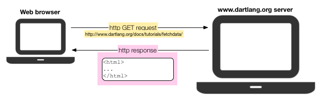

# HTTP - GET ve POST

## Http

1990 yılından beri dünya çapında ağ 
üzerinde kullanılan bir iletişim 
protokolüdür.  HTTP‘nin açılımı 
“Hyper Text Transfer Protocol” 
yani “Hiper Metin Transfer Protokolü“dür.  
HTTP protokolü ağ üzerinden web sayfalarının 
görüntülenmesini sağlayan protokoldür. 
HTTP protokolü istemci-kullanici (PC) 
ile sunucu (server) arasındaki alışveriş kurallarını belirler.  
Port olarak ise 80 portunu kullanır.  
İstemci sunucuya bir istek gönderir.  
Bu istek Internet Explorer, Google Chrome veya 
Mozilla Firefox gibi web browser’lar aracılığıyla iletilir.  
Sunucu bu isteği alır ve Apache veya IIS gibi 
web sunucu programları aracılığıyla cevap verir. 

## HTTP Durum Kodları

İstemci bir sunucu içeriğine HTTP kullanarak ulaşmaya 
çalıştığında sunucu yanıtın durumunu belirten 
bir sayısal kod gönderir.  
Bazı durumlarda  HTTP durum kodu (HTTP Status Code) 
istemcinin tarayıcısında da gösterilebilir.  
Örn; 200, 301, 302, 404 ve 500 kodları en yaygın olanlardır.
 

Durum kodlarında 1’den 5’e kadar gruplandırılmıştır. 

1xx     Bilgi 
2xx     Başarı 
3xx     Yönlendirme 
4xx     Tarayıcı Hatası 
5xx     Sunucu Hatası 

HTTP, web browser ile web server arasında
iletişim kurmamızı sağlayan bir protokoldür. 
HTTP 1.1 versiyonu (RFC 2616) ile tanımlanan
ve diğer eklentilerle gelen başlıca HTTP metodları şunlardır:
  
<h4>1-) GET:</h4> 

Bu metod sunucudan veri almak için kullanılır.  
GET ve POST metodları en sık kullanılan metodlar olup 
sunucudaki kaynaklara erişmek için kullanılırlar.
 

 

GET metodu ile sorgu metinleri URL içinde gönderilebilir.  Bunun en önemli faydası kullanıcıların bookmark edebilmeleri ve aynı sorguyu içeren istekleri daha sonra gönderebilmelerini sağlaması ve tarayıcıda önceki sorguların “geri” tuşu ile veya tarayıcı geçmişinden çağrılarak aynı sayfalara ulaşabilmeleridir.  Güvenlik açısından URL’lerin ekranda görüntüleniyor olması ve URL’in hedefine ulaşıncaya kadar ve hedef sunucu üzerinde iz kayıtlarında görülebilmesi gönderilen parametrelerin gizlilik ihtiyacı varsa sıkıntı yaratabilir.  Bu nedenlerle hassas isteklerin GET ile gönderilmemelidir.
 

<h4>2-)POST:<h4>  
Bu metod ile sunucuya veri yazdırabilirsiniz.  Bu metodla istek parametreleri hem URL içinde hem de mesaj gövdesinde gönderilebilir.  Sadece mesaj gövdesinin kullanımı yukarıda sayılan riskleri engelleyecektir.  Tarayıcılar geri butonuna basıldığında POST isteğinin mesaj gövdesinde yer alan parametreleri tekrar göndermek isteyip istemedimizi sorarlar.  Bunun temel nedeni bir işlemi yanlışlıkla birden fazla yapmayı engellemektir.  Bu özellik ve de güvenlik gerekçeleriyle bir işlem gerçekleştirileceğinde POST metodunun kullanılması önerilir. 

<h4>3-)PUT:<h4>   Bu metod ile servis sağlayıcı üzerindeki bir kaynağı güncelleyebilirsiniz.  Hangi kaynağı güncelleyecekseniz o kaynağın id’sini göndermek zorunludur. 

<h4>4-)HEAD:<h4>   GET metoduyla benzer işleve sahiptir ancak geri dönen yanıtta mesaj gövdesi bulunmaz (yani başlıklar ve içerikleri GET metoduyla aynıdır).  Bu nedenle GET mesajı gönderilmeden önce bir kaynağın var olup olmadığını kontrol etmek için kullanılabilir. 

<h4>5-)DELETE:<h4>   
Bu metod ile sunucudaki herhangi bir veriyi silebilirsiniz.

<h4>6-)CONNECT:<h4>   
Bir proxy sunucu üzerinden başka bir sunucuya bağlanmak ve proxy sunucuyu bir tünel gibi kullanmak için kullanılır. 

<h4>7-)OPTIONS:<h4>   
Bu metod belli bir kaynak için kullanılabilecek HTTP metodlarını sunucudan sorgulamak için kullanılır. 

<h4>8-)TRACE:<h4>   
Teşhis amaçlı kullanılan bir metoddur.  Sunucu bu metodla gelen istek mesajının içeriğini aynen yanıt gövdesinde geri göndermelidir.  Bu yöntemle sunucu ile istemci arasında bir vekil sunucu varsa bu sunucunun ve yaptığı değişikliklerin tespiti mümkün olabilir. 

<h4>9-)PATCH:<h4>   
Bu metod bir kaynağa istediğiniz küçük çaplı değişimi yapmanızı sağlar. 

<h4>10-)SEARCH:<h4>   
Bir dizinin altındaki kaynakları sorgulamak için kullanılır. 
