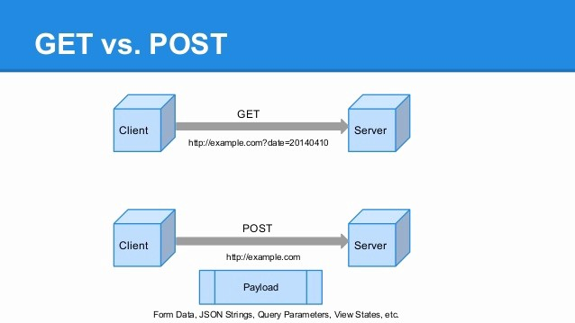

# GET vs POST

GET methodu kullanıldığında istekler URL kısmında gönderilir.  Gönderilen bilgiler URL’de görüntülendiği için güvenlik riski yüksektir ancak POST metoduna göre daha hızlıdır.

 
Ornegin: /test/demo_form.php?name1=value1&name2=value2  

POST metodu ise URL’de görüntülenmesi istemediğimiz istekler için kullanılır.  Gönderilen bilgiler URL’de görünmediği için daha güvenlidir ancak GET methoduna göre daha yavaştır.  Yani POST metodunda form alanları HTTP REQUEST HEADER içinde kodlanmış olarak gider, URL’de gözükmez.  POST işleminde her türlü dosyayı post edebiliriz: XML,Image, File post edebiliriz.
 
Orengin:  
POST /test/demo_form.php HTTP/1.1 
Host: w3schools.com 
name1=value1&name2=value2 

GET ile veri göndermede karakter limiti varken POST’ta böyle bir limit yoktur.  Karakter limiti GET metodunda 2048 karakterdir. 
GET’i ön plana çıkaran bir farktan bahsedelim.  GET ile değişkenler URL’de yer aldığı için sayfayı değişken değerleri kaybolmadan yer imlerine atmak mümkündür.  Yani GET ile bir sayfa içeriğini sunucudan almak için tekrar tekrar forma veri girmeye ya da sayfa içi tıklamalar yapılmasına gerek yoktur.  Dolayısıyla hazır URL’yi yer imlerine atarak kullanıcı zahmetten kurtarılmış olur.  POST’ta ise kullanıcı daha önce geldiği aşamaya(sayfa içeriğine) tekrar varabilmek için forma veri girme ya da tıklama zahmetlerine katlanmak zorundadır. 
GET’in POST’a karşı bir diğer dezavantajı şudur: multi-part binary türündeki verilerin gönderimi.  “multi-part binary” ile kastedilen şey dosyadır.  Örneğin; resimdir. POST ile forma bir resim koyup sunucuya upload edebiliriz.  Fakat GET ile bu mümkün değildir.

